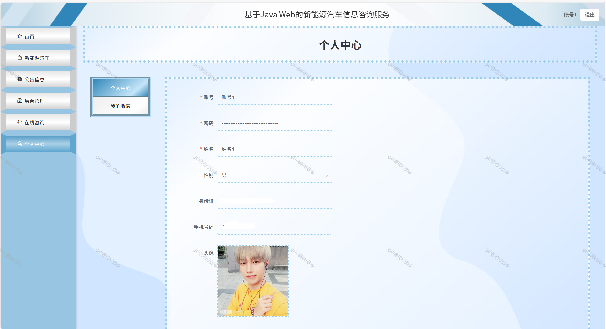

# springbootA216
springbootA216新能源汽车信息咨询服务系统
  
## 查看主页获取源码

### 一、关键词
新能源汽车咨询服务系统，新能源汽车智能咨询服务系统，新能源汽车数据咨询服务系统

### 二、作品包含
源码+数据库+设计文档万字+全套环境和工具资源+本地部署教程

### 三、项目技术
前端技术：Html、Css、Js、Vue2.0、Element-ui 
后端技术：Java、SpringBoot2.0、MyBatis

### 四、运行环境（以下版本亲测，其他版本未知，请自测）
开发工具：IDEA/eclipse  + VSCODE

数据库：MySQL5.7（最低要5.7版本）

数据库管理工具：Navicat10以上版本

环境配置软件： JDK1.8 + Maven3.6.3

前端Nodejs：14

浏览器：谷歌浏览器

### 五、项目介绍
项目编号：springbootA216

系统的顺利开发和实现，对于新能源汽车信息咨询这一方面提供巨大的便利服务，无论是管理员还是用户，都带来了极大的便利，方便大众，为社会的进步与发展提供了一些动力。
该系统从两个对象：由管理员和用户来对系统进行设计构建。主要功能包括：个人信息修改，对用户、品牌类别、新能源汽车、汽车订单、配送订单等功能进行管理。本系统在一般新能源汽车信息咨询服务的基础上增加了首页推送最新信息的功能，方便用户快速浏览，是一个高效的、动态的、交互友好的新能源汽车信息咨询服务。

### 六、运行截图

 
